# Figure 1: The Aspirin-ICD Parallel Timeline

## Mermaid Diagram

```mermaid
graph TD
    subgraph "ASPIRIN PRIMARY PREVENTION"
    A1[ATT Meta-Analysis 2009<br/>6 trials from 1980s-2000s<br/>12% RRR in vascular events<br/>NNT ~60]
    A2[THERAPEUTIC REVOLUTION<br/>2000s-2010s<br/>Universal statin use<br/>Modern BP control]
    A3[Baseline MI Risk<br/>15-20% → 3-5%<br/>70% reduction]
    A4[Modern RCTs 2018<br/>ARRIVE: Negative<br/>ASCEND: No net benefit<br/>ASPREE: Negative + harm]
    A5[GUIDELINE REVERSAL 2019<br/>ACC/AHA: Class III<br/>Aspirin NOT recommended]

    A1 --> A2
    A2 --> A3
    A3 --> A4
    A4 --> A5
    end

    subgraph "ICDs IN NICM"
    B1[Golwala/Al-Khatib Meta<br/>2015-2017<br/>Trials from 1990s-2000s<br/>23% RRR in SCD<br/>NNT ~54]
    B2[THERAPEUTIC REVOLUTION<br/>2014-2020<br/>ARNi PARADIGM-HF<br/>SGLT2i DAPA-HF/EMPEROR-R]
    B3[Baseline SCD Risk<br/>8-10% → 2-3%<br/>70% reduction]
    B4[Modern RCT 2016<br/>DANISH: Pre-ARNi/SGLT2i<br/>No mortality benefit<br/>HR 0.87, p=0.28]
    B5[GUIDELINES UNCHANGED<br/>2025<br/>ICDs still recommended<br/>based on obsolete data]

    B1 --> B2
    B2 --> B3
    B3 --> B4
    B4 -.-> B5
    end

    style A5 fill:#90EE90
    style B5 fill:#FFB6C1
```



## Alternative: Side-by-Side Timeline (For Publication)

```
YEAR    ASPIRIN PRIMARY PREVENTION          |    ICDs IN NICM
━━━━━━━━━━━━━━━━━━━━━━━━━━━━━━━━━━━━━━━━━━━━━━━━━━━━━━━━━━━━━━━━━━━━━━━━━━━━━
        ┌─────────────────────────┐         |    ┌─────────────────────────┐
1990s   │  Primary Prevention     │         |    │  CAT, AMIOVIRT          │
-2000s  │  Trials (pre-statin)    │         |    │  DEFINITE, SCD-HeFT     │
        │  Baseline MI: 15-20%    │         |    │  Baseline SCD: 8-10%    │
        └─────────────────────────┘         |    └─────────────────────────┘
                    │                        |                │
                    ▼                        |                ▼
        ┌─────────────────────────┐         |    ┌─────────────────────────┐
2009    │  ATT Meta-Analysis      │         |    │  Golwala Meta (2015)    │
        │  12% RRR, NNT ~60       │         |    │  Al-Khatib Meta (2017)  │
        │  → GUIDELINES SUPPORT   │         |    │  23% RRR, NNT ~54       │
        └─────────────────────────┘         |    │  → GUIDELINES SUPPORT   │
                    │                        |    └─────────────────────────┘
                    │                        |                │
        ╔═══════════════════════╗           |    ╔═══════════════════════╗
2010s   ║  STATIN REVOLUTION    ║           |    ║  ARNi/SGLT2i          ║
        ║  Baseline MI: 3-5%    ║           |    ║  REVOLUTION           ║
        ║  (70% reduction)      ║           |    ║  Baseline SCD: 2-3%   ║
        ╚═══════════════════════╝           |    ║  (70% reduction)      ║
                    │                        |    ╚═══════════════════════╝
                    ▼                        |                │
        ┌─────────────────────────┐         |                ▼
2016    │                         │         |    ┌─────────────────────────┐
        │                         │         |    │  DANISH Trial           │
        │                         │         |    │  (pre-ARNi/SGLT2i)      │
        │                         │         |    │  No mortality benefit   │
        └─────────────────────────┘         |    │  HR 0.87, p=0.28        │
                    │                        |    └─────────────────────────┘
                    ▼                        |                │
        ┌─────────────────────────┐         |                ▼
2018    │  ARRIVE: Negative       │         |    ┌─────────────────────────┐
        │  ASCEND: No net benefit │         |    │  ??? Awaiting new trial │
        │  ASPREE: Harm > benefit │         |    │  in full GDMT era       │
        └─────────────────────────┘         |    └─────────────────────────┘
                    │                        |                │
                    ▼                        |                ▼
        ┌─────────────────────────┐         |    ┌─────────────────────────┐
2019    │  ✓ GUIDELINES REVERSED  │         |    │  ✗ GUIDELINES           │
        │  Aspirin NOT            │         |    │    UNCHANGED            │
        │  recommended (Class III)│         |    │  ICDs still recommended │
        └─────────────────────────┘         |    │  (based on obsolete     │
                                             |    │   meta-analyses)        │
                                             |    └─────────────────────────┘
```

## Figure Legend

**Figure 1: Parallel Timelines of Aspirin Primary Prevention and ICDs in NICM**

The aspirin primary prevention story (left) and ICD story in non-ischemic cardiomyopathy (right) follow identical patterns. Both interventions were supported by meta-analyses of trials conducted in therapeutic eras that no longer exist. In both cases, revolutionary background therapies (statins for aspirin; ARNi/SGLT2i for ICDs) reduced baseline risk by ~70%. When tested in modern populations, aspirin showed no benefit (ARRIVE, ASCEND, ASPREE, 2018), leading to guideline reversal in 2019. Similarly, DANISH (2016) showed no mortality benefit for ICDs even before ARNi/SGLT2i became available. Yet guidelines remain unchanged for ICDs, despite the obsolescence of the supporting evidence.

ARNi: angiotensin receptor-neprilysin inhibitor; ATT: Antithrombotic Trialists' Collaboration; MI: myocardial infarction; NICM: non-ischemic cardiomyopathy; NNT: number needed to treat; RRR: relative risk reduction; SCD: sudden cardiac death; SGLT2i: sodium-glucose cotransporter-2 inhibitor.

---

## Data for Graphic Designer

**If submitting to journal with professional graphics team, provide:**

### Timeline Points

#### Aspirin Timeline:
1. **1980s-2000s**: Primary prevention trials (n=95,000)
   - Baseline MI risk: 15-20%

2. **2009**: ATT Meta-analysis published
   - 12% RRR
   - NNT: ~60
   - Guidelines recommend aspirin

3. **2010s**: Statin revolution
   - Baseline MI risk falls to 3-5%

4. **2018**: Three concordant modern trials
   - ARRIVE (n=12,546): Negative
   - ASCEND (n=15,480): No net benefit
   - ASPREE (n=19,114): Harm > benefit

5. **2019**: Guideline reversal
   - ACC/AHA Class III (NOT recommended)

#### ICD Timeline:
1. **1990s-2000s**: ICD trials in NICM
   - CAT (2002), AMIOVIRT (2003), DEFINITE (2004), SCD-HeFT (2005)
   - Baseline SCD risk: 8-10%

2. **2015-2017**: Meta-analyses published
   - Golwala 2015, Al-Khatib 2017
   - 23% RRR
   - NNT: ~54
   - Guidelines recommend ICDs

3. **2014-2020**: ARNi/SGLT2i revolution
   - PARADIGM-HF (2014), DAPA-HF (2019), EMPEROR-R (2020)
   - Baseline SCD risk falls to 2-3%

4. **2016**: DANISH trial
   - n=1,116
   - Enrollment 2008-2014 (before ARNi/SGLT2i)
   - No mortality benefit (HR 0.87, p=0.28)

5. **2025**: Guidelines unchanged
   - ICDs still recommended based on obsolete meta-analyses
   - Awaiting modern trial in full GDMT era

### Color Scheme Suggestion:
- **Green/checkmarks** for aspirin guideline reversal (appropriate response)
- **Red/warning** for ICD guidelines unchanged (inappropriate persistence)
- **Yellow/arrows** for therapeutic revolutions (statins, ARNi/SGLT2i)
- **Blue** for meta-analyses (old evidence)
- **Gray** for modern trials showing no benefit
