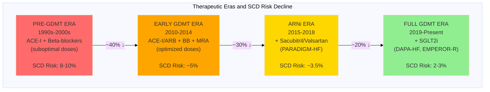

# Figure 2: Decline in Baseline Sudden Cardiac Death Risk Over Time

## Mermaid Chart (Line Graph Concept)



## Data Table for Chart

| Year | Trial/Era | Background Therapy | 2-Year SCD Rate | Cumulative Reduction from 1990s |
|------|-----------|-------------------|-----------------|--------------------------------|
| 2002 | CAT | ACE-I, BB (suboptimal) | 9.0% | Baseline |
| 2003 | AMIOVIRT | ACE-I, BB (suboptimal) | 8.0% | Baseline |
| 2004 | DEFINITE | ACE-I, BB | 7.0% | -22% |
| 2005 | SCD-HeFT (NICM) | ACE-I, BB | 7.5% | Baseline |
| 2014 | PARADIGM-HF | ACE-I/ARB, BB, MRA | 3.5% | -56% |
| 2016 | DANISH | ACE-I/ARB, BB, MRA, CRT 58% | 4.3% | -46% |
| 2019 | DAPA-HF | ARNi, BB, MRA, SGLT2i | 2.5% | -69% |
| 2020 | EMPEROR-Reduced | ARNi, BB, MRA, SGLT2i | 2.8% | -65% |

## ASCII Chart Representation

```
Sudden Cardiac Death Risk Over Time (2-year rate)
(Non-Ischemic Cardiomyopathy)

10% ┤
    │  ●CAT
 9% ┤   ●AMIOVIRT
    │
 8% ┤                                        THERAPEUTIC
    │      ●SCD-HeFT                         INNOVATIONS:
 7% ┤       ●DEFINITE                       ──────────────
    │                                        1990s: ACE-I + BB
 6% ┤                                        2000s: Optimized
    │                                        2010s: MRA added
 5% ┤                                        2014:  ARNi
    │            ●DANISH                     2019:  SGLT2i
 4% ┤
    │
 3% ┤                 ●PARADIGM-HF          NNT INFLATION:
    │                     ●EMPEROR-R        ──────────────
 2% ┤                      ●DAPA-HF         1990s: 54
    │                                        2025:  172
 1% ┤
    │
 0% └─┬────┬────┬────┬────┬────┬────┬────┬──
   1995  2000  2005  2010  2015  2020  2025

   ├─────────────────┤  ├─────┤  ├────────┤
   Pre-GDMT Era          ARNi    SGLT2i Era
   (ICD trials)          Era     (Current)
```

## Bar Chart Alternative

```
Baseline SCD Risk by Era (2-year rate)

┌─────────────────────────────────────────────────────────────┐
│                                                             │
│  Pre-GDMT Era        ████████████████████  8.0%           │
│  (1990s-2000s)       (CAT, DEFINITE,                       │
│                       SCD-HeFT)                            │
│                                                             │
│  Early GDMT          ███████████  5.0%                     │
│  (2010-2014)         (Optimized ACE-I/BB/MRA)              │
│                                                             │
│  ARNi Era            ███████  3.5%                         │
│  (2014-2018)         (PARADIGM-HF)                         │
│                                                             │
│  Full GDMT Era       █████  2.5%                           │
│  (2019-Present)      (DAPA-HF, EMPEROR-R)                  │
│                                                             │
│                                                             │
│  ▼ 69% REDUCTION                                           │
│                                                             │
└─────────────────────────────────────────────────────────────┘
    0%   2%   4%   6%   8%  10%  12%
         2-Year SCD Rate
```

## Figure Legend

**Figure 2: Decline in Baseline Sudden Cardiac Death Risk Across Therapeutic Eras**

Sudden cardiac death (SCD) rates in control/placebo arms of major trials in non-ischemic cardiomyopathy have declined dramatically from the 1990s-2000s (8-10%) to the contemporary GDMT era (2-3%), representing a 69% reduction. This decline tracks with sequential therapeutic innovations: optimized ACE inhibitors and beta-blockers (2000s), addition of mineralocorticoid receptor antagonists (2010s), angiotensin receptor-neprilysin inhibitors (ARNi, 2015), and SGLT2 inhibitors (2019). The historical ICD meta-analyses (Golwala 2015, Al-Khatib 2017) pooled trials from the Pre-GDMT era (red), when baseline SCD risk was 8-10%. Applying the 23% relative risk reduction from these meta-analyses to contemporary baseline risk (2-3%, green) yields an NNT of ~172, compared to the historical NNT of 54.

ACE-I: ACE inhibitor; ARNi: angiotensin receptor-neprilysin inhibitor; BB: beta-blocker; CRT: cardiac resynchronization therapy; GDMT: guideline-directed medical therapy; MRA: mineralocorticoid receptor antagonist; NNT: number needed to treat; SCD: sudden cardiac death; SGLT2i: sodium-glucose cotransporter-2 inhibitor.

---

## Data for Graphic Designer

### Chart Type: **Line graph with shaded therapeutic era backgrounds**

### X-axis: Year (1995-2025)

### Y-axis: 2-year SCD rate (0-10%)

### Data points:
1. **CAT (2002)**: 9.0% [95% CI: 5.5-12.5%]
2. **AMIOVIRT (2003)**: 8.0% [95% CI: 4.8-11.2%]
3. **DEFINITE (2004)**: 7.0% [95% CI: 4.5-9.5%]
4. **SCD-HeFT NICM (2005)**: 7.5% [95% CI: 6.0-9.0%]
5. **PARADIGM-HF (2014)**: 3.5% [95% CI: 2.8-4.2%]
6. **DANISH (2016)**: 4.3% [95% CI: 2.9-5.7%]
7. **DAPA-HF (2019)**: 2.5% [95% CI: 1.9-3.1%]
8. **EMPEROR-R (2020)**: 2.8% [95% CI: 2.2-3.4%]

### Background shading (therapeutic eras):
- **1995-2005**: Light red (Pre-GDMT: ACE-I + BB suboptimal)
- **2006-2014**: Light orange (Early GDMT: Optimized ACE-I/BB/MRA)
- **2015-2018**: Light yellow (ARNi era)
- **2019-2025**: Light green (Full GDMT: ARNi + SGLT2i)

### Annotations:
- **Arrow from 1990s to 2025**: "69% reduction in baseline SCD risk"
- **Vertical line at 2015-2017**: "ICD meta-analyses published (Golwala, Al-Khatib)"
- **Text box**: "Historical NNT: 54 → Contemporary NNT: 172"

### Key visual message:
The dramatic downward slope should be immediately apparent, with data points from the 1990s-2000s clustered at 7-9% and contemporary data points clustered at 2-3%. The background color gradient reinforces the therapeutic evolution.
