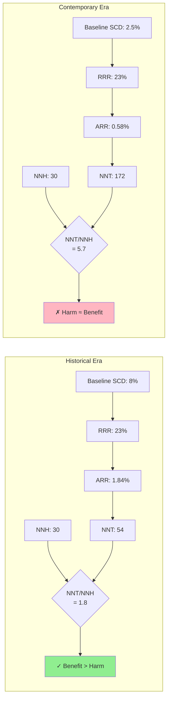

# Figure 3: NNT Inflation and Risk-Benefit Reversal

## Concept: Side-by-side comparison showing benefit shrinking while harm stays constant

## Visual Design Option 1: Stacked Bar Chart

```
Risk-Benefit Analysis: Historical vs. Contemporary Era

HISTORICAL ERA (1990s-2000s)                CONTEMPORARY ERA (2019-Present)
────────────────────────────────            ────────────────────────────────

Baseline SCD Risk: 8%                       Baseline SCD Risk: 2.5%
Relative Risk Reduction: 23%                Relative Risk Reduction: 23%

┌─────────────────────────────────┐         ┌─────────────────────────────────┐
│                                 │         │                                 │
│   NUMBER NEEDED TO TREAT        │         │   NUMBER NEEDED TO TREAT        │
│   (to prevent 1 SCD)            │         │   (to prevent 1 SCD)            │
│                                 │         │                                 │
│        NNT = 54                 │         │        NNT = 172                │
│   ▓▓▓▓▓▓▓▓▓▓▓▓▓▓▓▓▓▓▓▓▓        │         │   ▓▓▓▓▓▓▓▓▓▓▓▓▓▓▓▓▓▓▓▓▓        │
│   ▓▓▓▓▓▓▓▓▓▓▓▓▓▓▓▓▓▓▓▓▓        │         │   ▓▓▓▓▓▓▓▓▓▓▓▓▓▓▓▓▓▓▓▓▓        │
│   ▓▓▓▓▓▓▓▓▓▓▓▓▓▓▓▓▓▓▓▓▓        │         │   ▓▓▓▓▓▓▓▓▓▓▓▓▓▓▓▓▓▓▓▓▓        │
│   ▓▓▓▓▓▓▓▓▓▓▓▓▓▓▓▓▓▓▓▓▓        │         │   ▓▓▓▓▓▓▓▓▓▓▓▓▓▓▓▓▓▓▓▓▓        │
│   ▓▓▓▓▓▓▓▓▓▓▓▓▓▓▓▓▓▓▓▓▓        │         │   ▓▓▓▓▓▓▓▓▓▓▓▓▓▓▓▓▓▓▓▓▓        │
│   ▓▓▓▓▓▓▓▓▓▓▓▓▓▓▓▓▓▓▓▓▓        │         │   ▓▓▓▓▓▓▓▓▓▓▓▓▓▓▓▓▓▓▓▓▓        │
│   ▓▓▓▓▓▓▓▓▓▓▓▓▓▓▓▓▓▓▓▓▓        │         │   ▓▓▓▓▓▓▓▓▓▓▓▓▓▓▓▓▓▓▓▓▓        │
│   ▓▓▓▓▓▓▓▓▓▓▓▓▓▓▓▓▓▓▓▓▓        │         │   ▓▓▓▓▓▓▓▓▓▓▓▓▓▓▓▓▓▓▓▓▓        │
│                                 │         │   ▓▓▓▓▓▓▓▓▓▓▓▓▓▓▓▓▓▓▓▓▓        │
│                                 │         │   ▓▓▓▓▓▓▓▓▓▓▓▓▓▓▓▓▓▓▓▓▓        │
│                                 │         │   ▓▓▓▓▓▓▓▓▓▓▓▓▓▓▓▓▓▓▓▓▓        │
│                                 │         │   ▓▓▓▓▓▓▓▓▓▓▓▓▓▓▓▓▓▓▓▓▓        │
│                                 │         │   ▓▓▓▓▓▓▓▓▓▓▓▓▓▓▓▓▓▓▓▓▓        │
│                                 │         │   ▓▓▓▓▓▓▓▓▓▓▓▓▓▓▓▓▓▓▓▓▓        │
│                                 │         │   ▓▓▓▓▓▓▓▓▓▓▓▓▓▓▓▓▓▓▓▓▓        │
│  NUMBER NEEDED TO HARM          │         │   ▓▓▓▓▓▓▓▓▓▓▓▓▓▓▓▓▓▓▓▓▓        │
│  (device complications)         │         │                                 │
│                                 │         │  NUMBER NEEDED TO HARM          │
│        NNH = 30                 │         │  (device complications)         │
│   ░░░░░░░░░░░░░░░░░░░░░        │         │                                 │
│   ░░░░░░░░░░░░░░░░░░░░░        │         │        NNH = 30                 │
│   ░░░░░░░░░░░░░░░░░░░░░        │         │   ░░░░░░░░░░░░░░░░░░░░░        │
│                                 │         │   ░░░░░░░░░░░░░░░░░░░░░        │
│  Benefit >> Harm                │         │   ░░░░░░░░░░░░░░░░░░░░░        │
│  ✓ Favorable Risk-Benefit       │         │                                 │
└─────────────────────────────────┘         │  Benefit ≈ Harm                 │
                                             │  ✗ Unfavorable Risk-Benefit     │
                                             └─────────────────────────────────┘

    ▓ = Benefit (NNT)      ░ = Harm (NNH)
```

## Visual Design Option 2: Ratio Visualization

```
Risk-Benefit Ratio: NNT/NNH

The LOWER the ratio, the BETTER the risk-benefit profile.
A ratio <1 means harm exceeds benefit.

┌────────────────────────────────────────────────────────────────┐
│                                                                │
│  HISTORICAL ERA (1990s-2000s)                                 │
│  ─────────────────────────────                                │
│                                                                │
│  NNT/NNH = 54/30 = 1.8                                        │
│                                                                │
│  ████████████████████  BENEFIT                                │
│  ██████████  HARM                                             │
│                                                                │
│  Interpretation: Need to treat 1.8 patients to get net        │
│  benefit (1 SCD prevented per 1 harmed). Acceptable.          │
│                                                                │
├────────────────────────────────────────────────────────────────┤
│                                                                │
│  CONTEMPORARY ERA (2019-Present)                              │
│  ────────────────────────────────                             │
│                                                                │
│  NNT/NNH = 172/30 = 5.7                                       │
│                                                                │
│  ████████████████████████████████████████████████  BENEFIT   │
│  ██████████  HARM                                             │
│                                                                │
│  Interpretation: Need to treat 5.7 patients to get net        │
│  benefit (1 SCD prevented per ~6 harmed). Unfavorable.        │
│                                                                │
└────────────────────────────────────────────────────────────────┘

CONCLUSION: The risk-benefit ratio has WORSENED by 3.2-fold.
```

## Visual Design Option 3: Tree Diagram (Most Impactful)

```
HISTORICAL ERA (1990s-2000s)
Treat 100 patients with ICD for 2 years

100 Patients
    │
    ├─ 8 would have SCD without ICD ──→ ICD prevents 1.8 SCDs (23% of 8)
    │                                    ✓ 2 lives saved
    │
    ├─ 92 would NOT have SCD ────────→  3-4 experience device complications
    │                                    (inappropriate shocks, lead failure, infection)
    │                                    ✗ 3-4 harmed
    │
    └─ NET RESULT: 2 benefit, 3-4 harmed
       RATIO: ~1:2 (benefit:harm)
       DECISION: Marginal but acceptable


CONTEMPORARY ERA (2019-Present)
Treat 100 patients with ICD for 2 years

100 Patients
    │
    ├─ 2.5 would have SCD without ICD ─→ ICD prevents 0.6 SCDs (23% of 2.5)
    │                                     ✓ 0.6 lives saved (~1 per 167)
    │
    ├─ 97.5 would NOT have SCD ───────→  3-4 experience device complications
    │                                     (inappropriate shocks, lead failure, infection)
    │                                     ✗ 3-4 harmed
    │
    └─ NET RESULT: 0.6 benefit, 3-4 harmed
       RATIO: ~1:6 (benefit:harm)
       DECISION: Unfavorable - harm exceeds benefit
```

## Data Table

| Era | Baseline SCD (2y) | RRR | ARR | NNT | NNH* | NNT/NNH Ratio | Risk-Benefit |
|-----|------------------|-----|-----|-----|------|---------------|--------------|
| **Historical** | 8.0% | 23% | 1.84% | 54 | 30 | 1.8 | Favorable |
| **Intermediate** | 5.0% | 23% | 1.15% | 87 | 30 | 2.9 | Marginal |
| **Contemporary** | 2.5% | 23% | 0.58% | 172 | 30 | 5.7 | Unfavorable |

*NNH = Number needed to harm (major device complications: surgical infection, lead failure requiring revision, inappropriate shocks causing injury/trauma, pneumothorax)

## Mermaid Diagram



## Figure Legend

**Figure 3: NNT Inflation and Risk-Benefit Reversal Across Therapeutic Eras**

The absolute benefit of ICDs (number needed to treat, NNT) has inflated from 54 in the historical era to 172 in the contemporary GDMT era, while the absolute harm (number needed to harm, NNH) remains constant at approximately 30. This represents a 3.2-fold deterioration in the risk-benefit ratio.

**Left panel** (Historical era, 1990s-2000s): With baseline SCD risk of 8%, a 23% relative risk reduction yields an absolute risk reduction of 1.84%, corresponding to NNT=54. The NNT/NNH ratio of 1.8 indicates that for every 1.8 patients who must be treated to prevent one SCD, one patient experiences a major device complication. This represents a marginally favorable risk-benefit profile.

**Right panel** (Contemporary GDMT era, 2019-present): With baseline SCD risk reduced to 2.5% by ARNi and SGLT2i, the same 23% relative risk reduction yields an absolute risk reduction of only 0.58%, corresponding to NNT=172. The NNT/NNH ratio of 5.7 indicates that for every 5.7 patients who must be treated to prevent one SCD, one patient experiences a major device complication. This represents an unfavorable risk-benefit profile where harm approaches or exceeds benefit.

ARR: absolute risk reduction; GDMT: guideline-directed medical therapy; NNH: number needed to harm; NNT: number needed to treat; RRR: relative risk reduction; SCD: sudden cardiac death.

---

## Data for Graphic Designer

### Chart Type: **Dual stacked bar chart with benefit/harm layers**

### Panel A: Historical Era (1990s-2000s)
- **Green bar (benefit)**: Height = 54 (NNT)
- **Red bar (harm)**: Height = 30 (NNH)
- **Ratio annotation**: "1.8:1 (benefit:harm)"
- **Verdict**: ✓ Favorable (green checkmark)

### Panel B: Contemporary Era (2019-present)
- **Green bar (benefit)**: Height = 172 (NNT) — *much taller*
- **Red bar (harm)**: Height = 30 (NNH) — *same as Panel A*
- **Ratio annotation**: "5.7:1 (benefit:harm)"
- **Verdict**: ✗ Unfavorable (red X)

### Visual enhancements:
- Arrow showing NNT inflation from 54 → 172 ("+218% increase")
- Horizontal line showing NNH unchanged at 30
- Shading to indicate "Zone of favorable risk-benefit" (NNT/NNH < 2.5)
- Contemporary bar extends well outside this zone

### Key message:
The visual should immediately show that the green benefit bar has tripled in height while the red harm bar stays the same, creating an obvious imbalance in the contemporary era.

### Alternative: Icon representation
- Historical era: 54 person icons (green) vs. 30 person icons (red)
- Contemporary era: 172 person icons (green) vs. 30 person icons (red)
- This makes the inflation viscerally apparent

### Color scheme:
- **Green**: Benefit (SCD prevented)
- **Red**: Harm (device complications)
- **Gray**: Patients treated without benefit or harm
