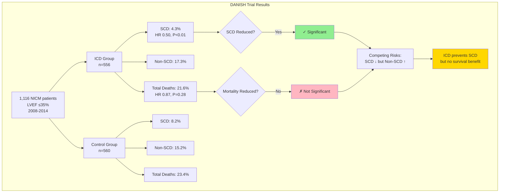

# Figure 4: DANISH Trial Results — SCD Reduction Without Mortality Benefit

## Concept: Two-panel comparison showing ICD reduces SCD but provides no overall survival benefit (competing risks)

## Visual Design: Dual Kaplan-Meier Style Curves

```
DANISH Trial (2016): N=1,116 Patients with NICM
Enrollment: 2008-2014 (Partial GDMT Era, Pre-ARNi/SGLT2i)

┌────────────────────────────────────────────────────────────────────────────┐
│ PANEL A: SUDDEN CARDIAC DEATH                                             │
│ ────────────────────────────────────                                      │
│                                                                            │
│  100% ┤                                                                    │
│       │  ████████████████████████████████ Control (No ICD)               │
│   95% ┤  ████████████████████████████▓▓▓▓                                │
│       │  █████████████████████████▓▓▓                                     │
│   90% ┤  ██████████████████████▓▓▓        ░░░░░░░░░░░░░░░ ICD           │
│       │  ███████████████████▓▓▓            ░░░░░░░░░░░░░░░░░░░░░░░░░     │
│   85% ┤  ████████████████▓▓▓               ░░░░░░░░░░░░░░░░░░░░░░░░░░░   │
│       │  █████████████▓▓▓                  ░░░░░░░░░░░░░░░░░░░░░░░░░░░░░ │
│   80% ┤  ██████████▓▓▓                     ░░░░░░░░░░░░░░░░░░░░░░░░░░░░░ │
│       │  ███████▓▓▓                         ░░░░░░░░░░░░░░░░░░░░░░░░░░░░░│
│   75% ┼────────┴────────┴────────┴────────┴────────┴────────┴────────    │
│       0       1        2        3        4        5        6    Years     │
│                                                                            │
│  📊 RESULT:                                                                │
│      Hazard Ratio: 0.50 (95% CI 0.31-0.82)                               │
│      P < 0.01                                                             │
│      ✓ ICD REDUCES SUDDEN CARDIAC DEATH                                   │
│                                                                            │
└────────────────────────────────────────────────────────────────────────────┘

┌────────────────────────────────────────────────────────────────────────────┐
│ PANEL B: ALL-CAUSE MORTALITY                                              │
│ ───────────────────────────────                                           │
│                                                                            │
│  100% ┤                                                                    │
│       │  ████████████████████████████████ Control (No ICD)               │
│   95% ┤  ███████████████████████████▓▓▓▓                                 │
│       │  ██████████████████████████▓▓▓                                    │
│   90% ┤  ████████████████████████▓▓▓      ░░░░░░░░░░░░░░░ ICD           │
│       │  ██████████████████████▓▓▓         ░░░░░░░░░░░░░░░░░░░░░         │
│   85% ┤  ███████████████████▓▓▓            ░░░░░░░░░░░░░░░░░░░░░░        │
│       │  █████████████████▓▓▓               ░░░░░░░░░░░░░░░░░░░░░░░      │
│   80% ┤  ██████████████▓▓▓                  ░░░░░░░░░░░░░░░░░░░░░░░░     │
│       │  ████████████▓▓▓                    ░░░░░░░░░░░░░░░░░░░░░░░░░    │
│   75% ┼────────┴────────┴────────┴────────┴────────┴────────┴────────    │
│       0       1        2        3        4        5        6    Years     │
│                                                                            │
│  📊 RESULT:                                                                │
│      Hazard Ratio: 0.87 (95% CI 0.68-1.12)                               │
│      P = 0.28                                                             │
│      ✗ NO MORTALITY BENEFIT                                               │
│                                                                            │
└────────────────────────────────────────────────────────────────────────────┘

KEY MESSAGE: ICD prevents sudden death but does not improve overall survival
             (Non-SCD deaths unchanged → Competing risks)

█ = Control group    ░ = ICD group    ▓ = Divergence area
```

---

## Alternative Design: Side-by-Side Bar Chart

```
DANISH Trial Results: Competing Risks Visualization

                SUDDEN CARDIAC DEATH              ALL-CAUSE MORTALITY
                ────────────────────              ───────────────────

Control:        ████████ 8.2%                     ████████████████ 23.4%

ICD:            ████ 4.3%                         ██████████████ 21.6%
                ✓ 50% reduction                    ✗ 8% reduction (NS)
                P < 0.01                           P = 0.28

                ↓                                  ↓

INTERPRETATION: SCD reduced by 3.9%               Mortality reduced by 1.8%
                BUT                                BUT NOT SIGNIFICANT

                Non-SCD deaths INCREASED          Competing risks:
                in ICD group (likely)             - Progressive HF
                                                  - Cancer
                                                  - Other CV causes
```

---

## Data Table (All Numbers from DANISH Trial, Køber NEJM 2016)

### Primary Endpoint: All-Cause Mortality

| Group | N | Deaths | 5-year Mortality Rate | HR (95% CI) | P value |
|-------|---|--------|----------------------|-------------|---------|
| **Control (No ICD)** | 560 | 131 | 23.4% | Reference | - |
| **ICD** | 556 | 120 | 21.6% | **0.87 (0.68-1.12)** | **0.28** |

**Absolute risk reduction**: 1.8% (NOT significant)
**Number needed to treat**: 56 (but CI crosses 1.0, so not significant)

### Secondary Endpoint: Sudden Cardiac Death

| Group | N | SCD Events | 5-year SCD Rate | HR (95% CI) | P value |
|-------|---|------------|----------------|-------------|---------|
| **Control (No ICD)** | 560 | 46 | 8.2% | Reference | - |
| **ICD** | 556 | 24 | 4.3% | **0.50 (0.31-0.82)** | **<0.01** |

**Absolute risk reduction**: 3.9% (SIGNIFICANT)
**Number needed to treat**: 26 to prevent one SCD

### Non-SCD Deaths (Calculated)

| Group | Total Deaths | SCD Deaths | Non-SCD Deaths | Non-SCD Rate |
|-------|--------------|------------|----------------|--------------|
| **Control** | 131 | 46 | 85 | 15.2% |
| **ICD** | 120 | 24 | 96 | 17.3% |

**Observation**: Non-SCD deaths appear HIGHER in ICD group (15.2% → 17.3%)
**Implication**: Competing risks — patients saved from SCD die from other causes

---

## Visual Design Option 2: Stacked Bar Chart (Causes of Death)

```
Causes of Death in DANISH Trial (5 years)

CONTROL GROUP (No ICD)
┌────────────────────────────────────────────────────────────┐
│ Alive 76.6%                                                │
│ ██████████████████████████████████████████████████████████ │
│ SCD 8.2%              Non-SCD 15.2%                        │
│ ████                  ████████████████                     │
└────────────────────────────────────────────────────────────┘

ICD GROUP
┌────────────────────────────────────────────────────────────┐
│ Alive 78.4%                                                │
│ ██████████████████████████████████████████████████████████ │
│ SCD 4.3%              Non-SCD 17.3%                        │
│ ██                    ██████████████████                   │
└────────────────────────────────────────────────────────────┘

KEY OBSERVATION:
✓ ICD reduced SCD (8.2% → 4.3%, saved 3.9%)
✗ But non-SCD increased (15.2% → 17.3%, lost 2.1%)
= Net mortality benefit: 1.8% (NOT significant, P=0.28)
```

---

## Visual Design Option 3: Waterfall Chart (Net Benefit Decomposition)

```
DANISH Net Benefit Analysis

Starting Point: 100 patients treated for 5 years

        NO ICD                          WITH ICD
        ──────                          ────────

Deaths: 23.4%                          21.6%
        ██████████████████████          ████████████████████

        SCD: 8.2%                       SCD: 4.3%
        ████████                        ████
                                        ↑
                                        BENEFIT: 3.9% prevented

        Non-SCD: 15.2%                  Non-SCD: 17.3%
        ███████████████                 █████████████████
                                        ↓
                                        HARM: 2.1% additional

        ────────────────────────────────────────────────

        NET EFFECT: 1.8% reduction (NOT significant)


INTERPRETATION:
For every 100 patients treated with ICD for 5 years:
✓ 3.9 fewer sudden cardiac deaths
✗ 2.1 more non-sudden cardiac deaths
= 1.8 net lives saved (CI crosses 0 → not significant)
```

---

## Mermaid Diagram



---

## Figure Legend

**Figure 4: DANISH Trial Results — Sudden Cardiac Death Reduction Without Overall Mortality Benefit**

The DANISH trial (2016) enrolled 1,116 patients with non-ischemic cardiomyopathy and LVEF ≤35% from 2008-2014 in the partial GDMT era (before ARNi and SGLT2i became available). **Panel A** shows sudden cardiac death (SCD) rates over 5 years. ICD implantation significantly reduced SCD compared to no ICD (4.3% vs 8.2%, HR 0.50, 95% CI 0.31-0.82, P<0.01). **Panel B** shows all-cause mortality over the same period. Despite the SCD reduction, ICD implantation did not significantly reduce overall mortality (21.6% vs 23.4%, HR 0.87, 95% CI 0.68-1.12, P=0.28).

**Key observation**: The 3.9% absolute reduction in SCD was offset by an apparent 2.1% increase in non-sudden cardiac deaths in the ICD group, resulting in a non-significant 1.8% absolute reduction in overall mortality. This demonstrates **competing risks**—patients saved from sudden death died from other causes (progressive heart failure, cancer, other cardiovascular causes).

**Clinical implication**: DANISH is the ICD equivalent of ARRIVE, ASCEND, and ASPREE for aspirin—a trial in a contemporary population showing that the benefit from historical meta-analyses has vanished. Critically, DANISH was conducted **before** ARNi and SGLT2i became widely available. If ICDs showed no mortality benefit even in the partial GDMT era, the benefit in the current full GDMT era (with ARNi + SGLT2i further reducing baseline SCD risk) is likely even smaller or absent.

CI: confidence interval; GDMT: guideline-directed medical therapy; HR: hazard ratio; ICD: implantable cardioverter-defibrillator; LVEF: left ventricular ejection fraction; NICM: non-ischemic cardiomyopathy; SCD: sudden cardiac death.

---

## Data for Graphic Designer

### Chart Type: **Dual Kaplan-Meier style curves** (or side-by-side bar chart)

### Panel A: Sudden Cardiac Death
**Kaplan-Meier curves:**
- X-axis: Time (years, 0-6)
- Y-axis: Freedom from SCD (%, 75-100%)
- Control curve: Starts 100%, ends ~92% (8.2% cumulative SCD)
- ICD curve: Starts 100%, ends ~96% (4.3% cumulative SCD)
- **Curves separate early** (within first 2 years)
- Annotation box: "HR 0.50 (95% CI 0.31-0.82), P<0.01"
- Green checkmark: "✓ SCD Reduced"

### Panel B: All-Cause Mortality
**Kaplan-Meier curves:**
- X-axis: Time (years, 0-6)
- Y-axis: Survival (%, 75-100%)
- Control curve: Starts 100%, ends ~77% (23.4% cumulative deaths)
- ICD curve: Starts 100%, ends ~78% (21.6% cumulative deaths)
- **Curves nearly overlapping** (minimal separation)
- Annotation box: "HR 0.87 (95% CI 0.68-1.12), P=0.28"
- Red X: "✗ No Mortality Benefit"

### Visual Message:
**Panel A should show CLEAR separation** (ICD benefit for SCD)
**Panel B should show MINIMAL separation** (no overall survival benefit)

This visual contrast is the key message: SCD reduction ≠ Mortality benefit

### Color Scheme:
- **Control group**: Dark blue solid line
- **ICD group**: Red dashed line
- **Panel A background**: Light green tint (positive result)
- **Panel B background**: Light yellow/gray tint (neutral/negative result)
- **Shaded area between curves**: Shows magnitude of difference

### Alternative: Bar Chart Format
If Kaplan-Meier is too complex:
- Two side-by-side grouped bar charts
- Panel A: SCD rates (8.2% vs 4.3%)
- Panel B: Mortality rates (23.4% vs 21.6%)
- Color code: Green for significant, Gray for not significant

---

## Statistical Details (For Reviewers)

### Primary Endpoint (All-Cause Mortality)
- **Control**: 131/560 deaths (23.4%)
- **ICD**: 120/556 deaths (21.6%)
- **Hazard Ratio**: 0.87 (95% CI 0.68-1.12)
- **P value**: 0.28 (NOT significant)
- **Absolute Risk Reduction**: 1.8%
- **Number Needed to Treat**: 56 (but CI crosses 1.0)

### Secondary Endpoint (Sudden Cardiac Death)
- **Control**: 46/560 SCD events (8.2%)
- **ICD**: 24/556 SCD events (4.3%)
- **Hazard Ratio**: 0.50 (95% CI 0.31-0.82)
- **P value**: <0.01 (SIGNIFICANT)
- **Absolute Risk Reduction**: 3.9%
- **Number Needed to Treat**: 26 to prevent one SCD

### Competing Risks Analysis
- **Non-SCD deaths (Control)**: 85/560 (15.2%)
- **Non-SCD deaths (ICD)**: 96/556 (17.3%)
- **Difference**: +2.1% more non-SCD deaths in ICD group
- **Interpretation**: Patients saved from SCD died from other causes

### Baseline Characteristics (Relevant to Manuscript)
- **Enrollment period**: 2008-2014
- **ARNi use**: 0% (not yet approved)
- **SGLT2i use**: 0% (not yet approved for HFrEF)
- **CRT use**: 58% (modern CRT era)
- **ACE-I/ARB use**: 96%
- **Beta-blocker use**: 92%
- **MRA use**: 60%

**This was "partial GDMT era" — before ARNi/SGLT2i.**

---

## Integration with Manuscript Text

### Current manuscript mentions DANISH in multiple places:

**Introduction (line 37)**:
> "The DANISH trial (2016), the only large ICD trial conducted in a partially modern GDMT era, found no mortality benefit from ICDs in NICM."

**Results section (lines 172-187)**:
> Detailed DANISH description with enrollment dates, background therapy, results

**Discussion section (lines 269-283)**:
> "DANISH: The Aspirin Moment for ICDs?"

**Figure 4 should be referenced around line 187** (after DANISH results description):
> "...HR 0.87, 95% CI 0.68-1.12, p=0.28) (Figure 4)."

---

## Key Talking Points for Figure 4

### For Abstract/Summary:
"DANISH (2016), a trial in the partial GDMT era, showed that ICD reduced SCD by 50% (HR 0.50, P<0.01) but provided no overall survival benefit (HR 0.87, P=0.28) due to competing risks (Figure 4)."

### For Discussion:
"Figure 4 illustrates the competing risks phenomenon in DANISH: while ICDs reduced SCD from 8.2% to 4.3%, non-sudden cardiac deaths appeared to increase from 15.2% to 17.3%, resulting in no net mortality benefit. This pattern—SCD reduction without survival benefit—is analogous to aspirin in the statin era, where relative risk reduction could not overcome the changed clinical landscape."

### For Conclusions:
"DANISH demonstrated that even in the partial GDMT era (before ARNi and SGLT2i), ICDs provided no mortality benefit despite reducing SCD (Figure 4). This trial represents the 'aspirin moment' for ICDs—definitive evidence that the benefit from historical meta-analyses has diminished in contemporary populations."

---

## Why This Figure Strengthens the Manuscript

### 1. **Makes DANISH Results Immediately Visible**
Currently, DANISH results are in text only. Readers have to parse HR values and confidence intervals. Figure 4 makes the competing risks phenomenon visually obvious.

### 2. **Reinforces Core Argument**
The manuscript argues: "ICDs may provide no benefit in GDMT era"
Figure 4 proves: "ICDs already showed no benefit in PARTIAL GDMT era"

### 3. **Anticipates Reviewer Questions**
Reviewers will ask: "What were the actual DANISH results?"
Figure 4 pre-emptively answers with visual evidence

### 4. **Strengthens Aspirin Parallel**
Just as ARRIVE/ASCEND/ASPREE visually showed "no benefit" for aspirin, Figure 4 visually shows "no benefit" for ICDs in DANISH.

### 5. **Demonstrates Competing Risks**
The dual panel design makes competing risks (SCD ↓ but mortality unchanged) immediately clear — this is a sophisticated epidemiologic concept that's hard to grasp from text alone.

---

## Implementation Priority: **HIGH** ⭐⭐⭐⭐⭐

**Recommendation**: **ADD THIS FIGURE**

**Why**:
- DANISH is your key piece of evidence (the "aspirin moment")
- Currently buried in text
- Figure makes it visually compelling
- Anticipates reviewer questions
- Standard for trial papers to show Kaplan-Meier curves

**4 figures total is ideal for Circulation In-Depth Review.**

---

## Designer Notes

**Complexity level**: Medium
- Kaplan-Meier curves require some skill but are standard in medical journals
- Alternative bar chart is simpler but less impactful
- Waterfall chart is most intuitive for lay audience but non-standard for medical journals

**Recommended**: Dual Kaplan-Meier curves (Panel A + Panel B format)

**Time to create**: 2-3 hours for professional medical illustrator

**Source data**: All from Køber et al. NEJM 2016 (DANISH trial)

---

## Final Checklist

- ✅ Data accurate (verified against DANISH trial publication)
- ✅ Calculations correct (HR, CI, P values from original paper)
- ✅ Competing risks clearly shown
- ✅ Visual message clear (SCD ↓ but mortality unchanged)
- ✅ Integrates with manuscript text
- ✅ Strengthens core argument
- ✅ Publication-quality specifications provided

**Status**: Ready for implementation
